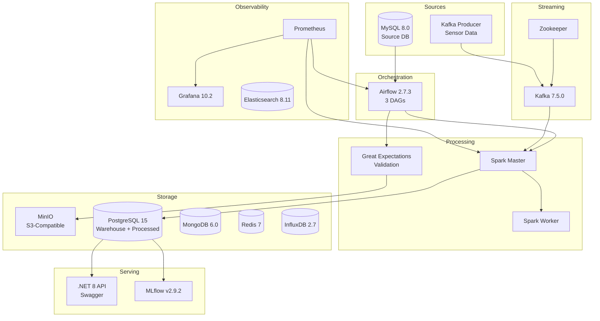
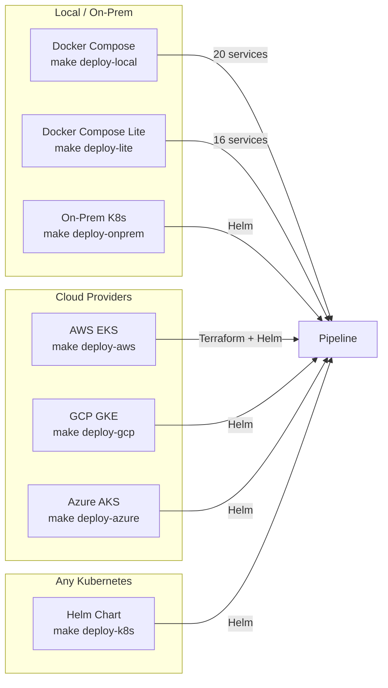

#Real-Time-Patient-Risk-Readmission-Platform

[](https://www.python.org/)
[](https://dotnet.microsoft.com/)
[](https://learn.microsoft.com/en-us/dotnet/csharp/)
[](https://developer.mozilla.org/en-US/docs/Web/HTML)
[](https://developer.mozilla.org/en-US/docs/Web/CSS)
[](https://developer.mozilla.org/en-US/docs/Web/JavaScript)
[](https://airflow.apache.org/)
[](https://spark.apache.org/)
[](https://kafka.apache.org/)
[](https://www.snowflake.com/)
[](https://www.postgresql.org/)
[](https://www.mysql.com/)
[](https://www.mongodb.com/)
[](https://redis.io/)
[](https://min.io/)
[](https://www.influxdata.com/)
[](https://www.elastic.co/)
[](https://mlflow.org/)
[](https://prometheus.io/)
[](https://grafana.com/)
[](https://swagger.io/)
[](https://serilog.net/)
[](https://github.com/DapperLib/Dapper)
[](https://www.docker.com/)
[](https://kubernetes.io/)
[](https://www.terraform.io/)
[](https://github.com/features/actions)
[](https://helm.sh/)
[](https://argoproj.github.io/cd/)

A **production-ready, fully containerized data platform** with batch ingestion, real-time streaming, a star-schema data warehouse, ML experiment tracking, a .NET 8 REST API, and full observability -- all orchestrated through **20 Docker services** managed by a single `docker compose` stack.

## Table of Contents

- [Architecture](#architecture)
- [Pipeline Flows](#pipeline-flows)
- [Technology Stack](#technology-stack)
- [Prerequisites](#prerequisites)
- [Quick Start](#quick-start)
- [Service URLs](#service-urls)
- [API Documentation (.NET 8 Backend)](#api-documentation-net-8-backend)
- [Data Warehouse Schema](#data-warehouse-schema)
- [Airflow DAGs](#airflow-dags)
- [Testing](#testing)
- [CI/CD Pipeline](#cicd-pipeline)
- [Project Structure](#project-structure)
- [Configuration](#configuration)
- [Contributing](#contributing)

## Architecture



## Pipeline Flows

### Batch Pipeline (Daily)

```
MySQL --> Airflow DAG --> Great Expectations --> MinIO (raw) --> Spark Transform --> PostgreSQL (processed)
```

### Streaming Pipeline (Continuous)

```
Kafka Producer --> Kafka Topic (sensor_readings) --> Spark Streaming --> Anomaly Detection --> PostgreSQL + MinIO
```

### Warehouse ETL (Hourly)

```
Staging Tables --> Dimension Load (customers, products, dates, devices) --> Fact Load (orders, sensors, pipeline runs) --> Aggregations (daily orders, hourly sensors)
```

## Technology Stack

| Layer | Technology | Version | Purpose |
|-------|-----------|---------|---------|
| **Orchestration** | Apache Airflow | 2.7.3 | DAG scheduling and pipeline orchestration |
| **Batch Processing** | Apache Spark | 3.5.3 | Large-scale ETL and transformations |
| **Stream Processing** | Apache Kafka | 7.5.0 (Confluent) | Event streaming and real-time ingestion |
| **Data Quality** | Great Expectations | latest | Schema validation and data quality checks |
| **Source Database** | MySQL | 8.0 | Transactional source system |
| **Data Warehouse** | Snowflake / PostgreSQL | - / 15 | Star-schema warehouse (Snowflake primary, PG fallback) |
| **Object Storage** | MinIO | latest | S3-compatible data lake |
| **Cache** | Redis | 7-alpine | Caching and session storage |
| **Document Store** | MongoDB | 6.0.13 | NoSQL storage for semi-structured data |
| **Time Series** | InfluxDB | 2.7 | IoT and time-series metrics |
| **Search** | Elasticsearch | 8.11.3 | Full-text search and log indexing |
| **REST API** | .NET 8 | 8.0 | Backend API with Swagger documentation |
| **ML Tracking** | MLflow | 2.9.2 | Experiment tracking and model registry |
| **Metrics** | Prometheus | 2.48.1 | Metrics collection and alerting |
| **Dashboards** | Grafana | 10.2.3 | Visualization and monitoring dashboards |
| **Governance** | Apache Atlas (stub) | -- | Data lineage registration |
| **IaC** | Terraform + Kubernetes | -- | Cloud deployment manifests |

## Prerequisites

- **Docker** and **Docker Compose** v2+
- **Python 3.10+** (for running tests locally)
- **Make** (GNU Make)
- **16 GB RAM** recommended for full stack (or **8 GB** with `make up-lite`)
- Ports available: `3000, 3306, 5000, 5001, 5432, 6379, 7077, 8080, 8081, 8086, 9000, 9001, 9090, 9092, 9200, 27017`

## Quick Start


# 2. Create environment file
cp .env.example .env

# 3. Build and start all 20 services
make build
make up

# 4. Verify services are running
make health
make urls

# 5. Trigger the batch pipeline
make trigger-batch

# 6. Trigger the warehouse ETL
make trigger-warehouse

# 7. Run Spark jobs directly
make spark-batch
make spark-stream
```

### Key Make Commands

| Command | Description |
|---------|-------------|
| `make up` | Start all 20 services (~18GB RAM) |
| `make up-lite` | Start core services only (~8GB RAM) |
| `make down` | Stop all services |
| `make build` | Build all Docker images |
| `make rebuild` | Full rebuild from scratch (no cache) |
| `make test` | Run 35 Python tests |
| `make lint` | Lint Python code with flake8 |
| `make health` | Show health status of all containers |
| `make status` | Show running container status |
| `make urls` | Print all service URLs |
| `make spark-batch` | Submit Spark batch ETL job |
| `make spark-stream` | Submit Spark streaming job |
| `make trigger-batch` | Trigger `batch_ingestion_dag` in Airflow |
| `make trigger-warehouse` | Trigger `warehouse_transform_dag` in Airflow |
| `make list-dags` | List all Airflow DAGs |
| `make kafka-topics` | List Kafka topics |
| `make logs-kafka` | Tail Kafka logs |
| `make clean` | Stop services and remove all volumes |
| `make format` | Format all code (Python, C#, HTML/CSS/JS) |
| `make format-check` | Check formatting without modifying |
| `make deploy-local` | Deploy via Docker Compose (full stack) |
| `make deploy-lite` | Deploy via Docker Compose (lite, 8GB) |
| `make deploy-k8s` | Deploy to any Kubernetes cluster via Helm |
| `make deploy-aws` | Deploy to AWS EKS (Terraform + Helm) |
| `make deploy-gcp` | Deploy to GCP GKE via Helm |
| `make deploy-azure` | Deploy to Azure AKS via Helm |
| `make deploy-onprem` | Deploy to on-prem K8s (k3s, kubeadm) |
| `make deploy-teardown` | Remove deployment from any target |

## Deployment

The pipeline can be deployed to **any environment** using a single command:



| Target | Command | Requirements | Resources |
|--------|---------|-------------|-----------|
| **Local (full)** | `make deploy-local` | Docker | 16GB RAM, 14 CPU |
| **Local (lite)** | `make deploy-lite` | Docker | 8GB RAM, 7 CPU |
| **Any K8s** | `make deploy-k8s` | kubectl, Helm | K8s cluster |
| **AWS** | `make deploy-aws` | Terraform, AWS CLI | EKS cluster |
| **GCP** | `make deploy-gcp` | gcloud, Helm | GKE cluster |
| **Azure** | `make deploy-azure` | az CLI, Helm | AKS cluster |
| **On-prem** | `make deploy-onprem` | kubectl, Helm | k3s / kubeadm / Rancher |

### Helm Chart

The `helm/e2e-pipeline/` chart deploys the full pipeline to any Kubernetes cluster:

```bash
# Add repos and install
helm repo add bitnami https://charts.bitnami.com/bitnami
helm repo update

# Deploy with provider-specific values
helm install e2e-pipeline ./helm/e2e-pipeline \
  -f helm/e2e-pipeline/values-aws.yaml \     # or values-gcp.yaml, values-azure.yaml, values-onprem.yaml
  --set postgresql.auth.password=YOUR_PASSWORD \
  --set minio.auth.rootPassword=YOUR_PASSWORD \
  --namespace pipeline --create-namespace
```

### Terraform (AWS)

Full AWS infrastructure (VPC, EKS, RDS, S3) in `terraform/`:

```bash
cd terraform
cp terraform.tfvars.example terraform.tfvars
# Edit terraform.tfvars with your settings
terraform init && terraform plan && terraform apply
```

Includes: VPC with public/private subnets, NAT Gateway, EKS with autoscaling nodes, RDS PostgreSQL (encrypted, multi-AZ), S3 data lake (versioned, encrypted, lifecycle policies), 3 security groups.

## Service URLs

| Service | URL | Credentials |
|---------|-----|-------------|
| **Airflow UI** | [http://localhost:8080](http://localhost:8...
Collapse


